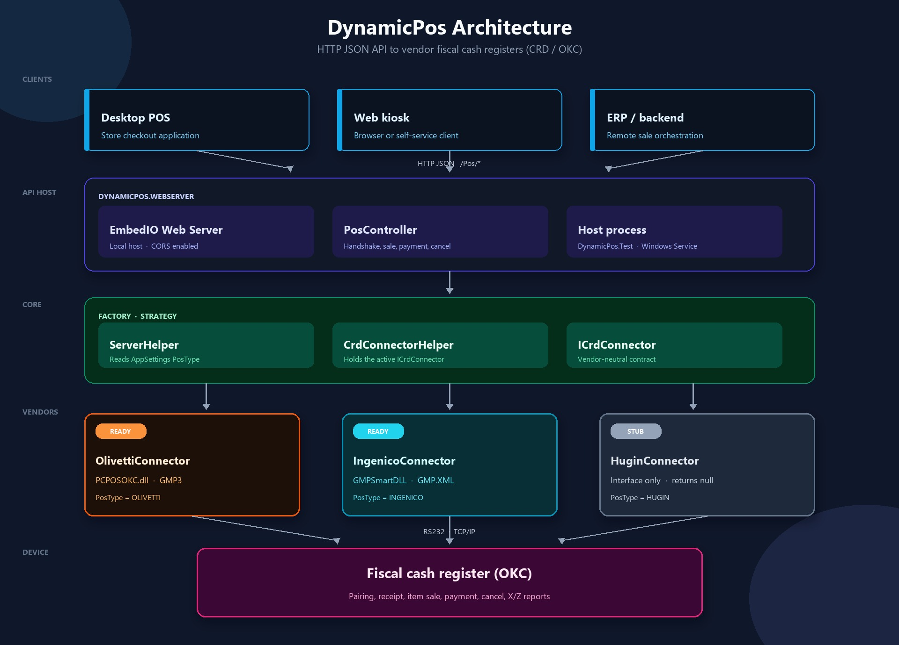

# DynamicPos

DynamicPos is a Windows-based fiscal cash-register (CRD / ÖKC) integration service for Turkish POS devices. It exposes a local HTTP JSON API so a store, ERP, or POS application can talk to vendor-specific fiscal printers through one contract.

The service selects a device vendor at startup, pairs with the terminal (handshake), then runs the fiscal sale lifecycle: start receipt, print items, take payment, close or cancel the document.

**Supported vendors**

| Vendor | Connector | Status |
| --- | --- | --- |
| Olivetti | `OlivettiConnector` via `PCPOSOKC.dll` (GMP3) | Implemented |
| Ingenico | `IngenicoConnector` via `GMPSmartDLL` | Implemented |
| Hugin | `HuginConnector` | Stub only (methods return `null`) |

---

## Contents

- [What it does](#what-it-does)
- [Architecture](#architecture)
- [Solution structure](#solution-structure)
- [Requirements](#requirements)
- [Getting started](#getting-started)
- [Configuration](#configuration)
- [Fiscal sale flow](#fiscal-sale-flow)
- [HTTP API](#http-api)
- [Vendor notes](#vendor-notes)
- [Logging](#logging)
- [Adding a new POS vendor](#adding-a-new-pos-vendor)
- [Known limitations](#known-limitations)

---

## What it does

A typical client application (desktop POS, web kiosk, or backend) sends HTTP requests to DynamicPos. DynamicPos translates those requests into the vendor SDK / DLL protocol and returns JSON results.

Capabilities:

- Pair / handshake with the fiscal device over **RS232** or **TCP/IP**
- Check whether the device is still connected
- Open a fiscal receipt or invoice (fiş / fatura)
- Print one or more sale items (department sale)
- Collect cash (`01`) or bank-card (`02`) payment
- Cancel a payment (Olivetti)
- Close the receipt (print fiscal memory / end receipt)
- Void the open document
- Read the current receipt total (Olivetti)
- Run the full sale in one request (`DoAllProcess`)
- Daily X / Z reports on the connector interface (Olivetti implements them; they are not exposed as HTTP endpoints yet)

Currency used by the Ingenico path is **TRY (ISO 4217 code 949)**. Amounts are generally sent as **kuruş-style strings** (see [Amounts](#amounts)).

---

## Architecture



Clients send HTTP JSON to the EmbedIO host. `PosController` forwards each call through `ServerHelper` and `CrdConnectorHelper` to the `ICrdConnector` selected by `PosType`. That connector talks to the fiscal cash register over RS232 or TCP/IP.

Design notes:

- **Strategy pattern.** All vendors implement `ICrdConnector`. The HTTP layer never talks to a vendor type directly.
- **Factory.** `ServerHelper.CrdConnectorHelper` instantiates the connector from `PosType` (`OLIVETTI`, `INGENICO`, `HUGIN`) the first time it is used.
- **Local HTTP host.** `Unosquare.Labs.EmbedIO` 2.2.1 serves the API. CORS is enabled.
- **Windows service host exists** (`DynamicPos` project) but `OnStart` / `OnStop` are empty. The working host for development is **`DynamicPos.Test`**, a console app that starts the web server.

---

## Solution structure

Visual Studio 2017 solution (`DynamicPos.sln`), target framework **.NET Framework 4.5.2**.

| Project | Type | Role |
| --- | --- | --- |
| `DynamicPos` | Windows Service (`WinExe`) | Intended production host. Currently only configures log4net and starts an empty `Service1`. |
| `DynamicPos.Test` | Console (`Exe`) | Development host. Starts EmbedIO and waits on `Console.ReadLine()`. |
| `DynamicPos.WebServer` | Class library | EmbedIO server, `PosController`, vendor factory. |
| `DynamicPos.CrdService` | Class library | `ICrdConnector` contract and `CrdConnectorHelper`. |
| `DynamicPos.CrdData` | Class library | Shared request / response models. |
| `DynamicPos.Olivetti` | Class library | Olivetti / GMP3 connector (`PCPOSOKC`). |
| `DynamicPos.Ingenico` | Class library | Ingenico GMP3 connector (`GMPSmartDLL`). |
| `DynamicPos.Hugin` | Class library | Placeholder connector. |
| `DynamicPos.Utils` | Class library | log4net logger, INI helper, amount / BCD helpers. |
| `DynamicPos.Libraries` | Class library | Native / vendor DLLs (`PCPOSOKC.dll`). |

Solution folders: `Presentation`, `WebServer`, `CrdBase`, `Pos` (Olivetti / Ingenico / Hugin), `Utils`, `Libraries`.

### Project dependencies

```
DynamicPos.Test
  └── DynamicPos.WebServer
        ├── DynamicPos.CrdService ── DynamicPos.CrdData
        ├── DynamicPos.CrdData
        ├── DynamicPos.Olivetti ── CrdService, CrdData, Utils, PCPOSOKC.dll
        ├── DynamicPos.Ingenico ── CrdService, CrdData, Utils, GMPSmartDLL
        ├── DynamicPos.Hugin    ── CrdService, CrdData, Utils
        └── DynamicPos.Utils

DynamicPos (Windows Service)
  └── DynamicPos.Utils
```

---

## Requirements

- Windows (serial / TCP access to the fiscal device)
- Visual Studio 2017 or later (solution format 15.0)
- .NET Framework 4.5.2 Developer Pack
- NuGet restore
- A connected fiscal terminal (Olivetti or Ingenico) **or** a vendor simulator
- Vendor native libraries:
  - Olivetti: `DynamicPos.Libraries/PCPOSOKC.dll`
  - Ingenico: `DynamicPos.Ingenico/GMPSmartDLL.dll` and `GMP.XML` (copied to the output directory)

### NuGet packages

| Package | Version | Used by |
| --- | --- | --- |
| EmbedIO | 2.2.1 | WebServer |
| Unosquare.Swan.Lite | 0.39.0 | WebServer (EmbedIO dependency) |
| Newtonsoft.Json | 12.0.2 | WebServer, CrdData, CrdService, vendor projects |
| log4net | 2.0.8 | Utils |

---

## Getting started

### 1. Restore and build

```powershell
nuget restore DynamicPos.sln
msbuild DynamicPos.sln /p:Configuration=Debug
```

Or open `DynamicPos.sln` in Visual Studio and build.

### 2. Configure the test host

Edit `DynamicPos.Test/App.config`:

```xml
<appSettings>
  <add key="PosType" value="INGENICO"/>
  <add key="ApiPrefixes" value="http://127.0.0.1:82/"/>
  <add key="ConType" value="RS232"/>
  <add key="ServerPort" value="41200"/>
  <add key="ServerAddress" value="10.62.36.201"/>
  <add key="CashierId" value="00"/>
  <add key="CashierPassword" value="1234"/>
  <add key="EcrMode" value="02"/>
</appSettings>
```

Set `PosType` to `OLIVETTI` or `INGENICO`. `HUGIN` is not implemented.

### 3. Run the API

Set **`DynamicPos.Test`** as the startup project and run it. The process starts EmbedIO and keeps the console open.

If Windows HTTP.sys rejects the URL prefix, reserve it once (elevated command prompt):

```bat
netsh http add urlacl url=http://127.0.0.1:82/ user=%USERNAME%
```

### 4. Smoke-check the listener

```http
GET http://127.0.0.1:82/Pos/CheckConnection
```

Unknown routes return a simple HTML 404. Request URL, body, and headers are written to the log.

### Windows service (not wired yet)

`DynamicPos` is a `ServiceBase` host:

- `Program.Main` configures log4net and calls `ServiceBase.Run(new Service1())`.
- `Service1.OnStart` / `OnStop` do not start or stop the web server.

To use it as a service you would install it with `InstallUtil` / `sc.exe` **after** `OnStart` calls `ServerHelper.GetInstance().Start()` and `OnStop` calls `Stop()`. Until then, use `DynamicPos.Test`.

---

## Configuration

### `PosType`

Read by `ServerHelper`. Case-sensitive values:

| Value | Connector |
| --- | --- |
| `OLIVETTI` | `OlivettiConnector` |
| `INGENICO` | `IngenicoConnector` |
| `HUGIN` | `HuginConnector` |

Any other value throws `InstanceNotFoundException`.

### `ApiPrefixes`

Comma-separated EmbedIO prefixes. The first value is stored as `ServerInit.UrlPrefixes`. Example:

```text
http://127.0.0.1:82/
```

Multiple prefixes are supported: `http://127.0.0.1:82/,http://localhost:82/`.

### Test host extras

These keys exist in `DynamicPos.Test/App.config`. Handshake values for Olivetti are normally sent in the HTTP body, not read from config at request time. They are useful as defaults / documentation for the cashier login:

| Key | Meaning |
| --- | --- |
| `ConType` | `RS232` or `TCPIP` |
| `ServerAddress` | Device IP when using TCP |
| `ServerPort` | Device TCP port |
| `CashierId` | Cashier number (`00`, `01`, …) |
| `CashierPassword` | Cashier PIN |
| `EcrMode` | `02` = sale mode, `03` = admin mode |

### Ingenico `GMP.XML`

Copied next to the running executable. Handshake rewrites these nodes from the request:

| XPath | Source field |
| --- | --- |
| `GMP/INTERFACE/@ID` | `\\.\` + `ComPort` |
| `GMP/INTERFACE/PortName` | `\\.\` + `ComPort` |
| `GMP/INTERFACE/IsTcpConnection` | `true` when `PosConnectionType` is not `RS232` |
| `GMP/INTERFACE/IP` | `PosIp` |
| `GMP/INTERFACE/Port` | `PosIpPort` |

Default file uses COM3 / 9600 8N1 and TCP `127.0.0.1:7500`.

---

## Fiscal sale flow

Use either the **step-by-step** API or the **single-shot** API.

### Step-by-step

```
1. POST /Pos/HandShake          pair, open port, cashier login (Olivetti)
2. GET  /Pos/CheckConnection    ping / connected flag
3. POST /Pos/StartReceipt       open receipt / invoice
4. POST /Pos/PrintItem          department item sale (one or more lines)
5. GET  /Pos/GetSumTotal        optional; Olivetti only
6. POST /Pos/PrintPayment       cash or card
7. POST /Pos/CloseReceipt       print totals / fiscal memory and close

On error:
   POST /Pos/CancelPayment      reverse a payment (Olivetti)
   POST /Pos/CancelDocument     void the open ticket
```

Handshake must succeed before receipt operations. Olivetti `DoAllProcess` also switches ECR mode to `02` (sale).

### Single-shot

`POST /Pos/DoAllProcess` runs connect → start receipt → items → payment → close in one call. The response includes each step result and `ProcessStep` (the last successful / failed stage).

Ingenico `DoAllProcess` stops early if connection, start receipt, payment, or close is not `200`. Olivetti also validates Turkish success messages (`Başarılı`) and fills a zero payment amount from `GetSumAmount`.

---

## HTTP API

Base URL comes from `ApiPrefixes` (default `http://127.0.0.1:82/`).

All successful bodies are `application/json` (UTF-8). Request bodies are deserialized with Newtonsoft.Json. The raw body is logged.

Unhandled exceptions return **500** with an empty JSON body. Invalid / missing bodies on some POST endpoints return **400**.

### Endpoint summary

| Method | Path | Body | Purpose |
| --- | --- | --- | --- |
| GET | `/Pos/CheckConnection` | — | Device connection status |
| POST | `/Pos/HandShake` | `HandShakeModel` | Pair and open the device |
| POST | `/Pos/StartReceipt` | `DocumentHeaderModel` | Open receipt / invoice |
| POST | `/Pos/PrintItem` | `SaleItemDataModel` | Print sale lines |
| POST | `/Pos/PrintPayment` | `SalePaymentDataModel` | Take payment |
| POST | `/Pos/CancelPayment` | `CancelPaymentModel` | Reverse payment |
| POST | `/Pos/CloseReceipt` | — | Close and fiscalize |
| POST | `/Pos/CancelDocument` | — | Void open document |
| GET | `/Pos/GetSumTotal` | — | Current receipt total |
| POST | `/Pos/DoAllProcess` | `DoAllProcessModel` | Full sale in one request |

---

### `GET /Pos/CheckConnection`

**Response — `ConnectionResultModel`**

| Field | Type | Description |
| --- | --- | --- |
| `StatusCode` | HTTP status | `200` connected, otherwise error (`500` Ingenico, `400` Olivetti) |
| `Message` | string | Olivetti error / success text from the ECR |

Ingenico returns `200` only after a successful handshake (`Connected == true`).

---

### `POST /Pos/HandShake`

**Request — `HandShakeModel`**

| Field | Type | Description |
| --- | --- | --- |
| `PosConnectionType` | string | `RS232` or `TCPIP` |
| `PosIp` | string | Device IP (TCP) |
| `PosIpPort` | string | Device port (TCP) |
| `ComPort` | string | Serial name, e.g. `COM3` |
| `EncDisable` | string | Olivetti: `1` disables encrypted messages; any other value encrypts |
| `CashierId` | string | Cashier id (`00`, `01`, …) |
| `CashierPassword` | string | Cashier password |
| `EcrMode` | string | `02` sale, `03` admin |
| `DeviceBrand` | string | Ingenico pairing: external device brand |
| `DeviceModel` | string | Ingenico pairing: model |
| `DeviceSerial` | string | Ingenico pairing: serial |
| `DeviceEcrSerial` | string | Ingenico pairing: ECR serial |

**Olivetti handshake steps**

1. Open RS232 or TCP with `EcrInterface.COMM_Open`
2. Set encryption from `EncDisable`
3. GMP3 pair (`msgREQ_GMP3Pair`)
4. ECR config
5. Cashier login
6. Change ECR mode

**Ingenico handshake steps**

1. Write connection fields into `GMP.XML`
2. `FP3_StartPairingInit` with brand / model / serial / ECR serial
3. Set `Connected` when the SDK return code is `0`

**Example — RS232 Olivetti**

```json
{
  "PosConnectionType": "RS232",
  "ComPort": "COM3",
  "EncDisable": "0",
  "CashierId": "00",
  "CashierPassword": "1234",
  "EcrMode": "02"
}
```

**Example — TCP Ingenico**

```json
{
  "PosConnectionType": "TCPIP",
  "PosIp": "10.62.36.201",
  "PosIpPort": "7500",
  "DeviceBrand": "PC",
  "DeviceModel": "DynamicPos",
  "DeviceSerial": "00000001",
  "DeviceEcrSerial": "ECRSERIAL"
}
```

**Response — `HandShakeResultModel`**

| Field | Type | Description |
| --- | --- | --- |
| `HttpStatusCode` | HTTP status | `200` or `500` |

---

### `POST /Pos/StartReceipt`

**Request — `DocumentHeaderModel`**

JSON property names differ from C# names:

| JSON | C# | Description |
| --- | --- | --- |
| `DocumentType` | `DocType` | Document type (Olivetti, 2 digits, e.g. receipt vs invoice) |
| `TCKN` | `CustomerTcNo` | Customer national id |
| `VKN` | `CustomerVkNo` | Customer tax number |

Ingenico builds an invoice header (`TInvoice`), currency `949`. Empty TCKN / VKN are replaced with `11111111111`.

**Example**

```json
{
  "DocumentType": "01",
  "TCKN": "11111111111",
  "VKN": ""
}
```

**Response — `DocumentHeaderResultModel`**

| Field | Description |
| --- | --- |
| `ZNum` | Daily Z counter |
| `ReceiptNum` | Receipt / fiscal number |
| `TranDate` | Transaction date (Olivetti) |
| `TranTime` | Transaction time (Olivetti) |
| `ProcessMessage` | ECR message (Olivetti) |
| `StatusCode` | `200` or `400` |

---

### `POST /Pos/PrintItem`

**Request — `SaleItemDataModel`**

| Field | Description |
| --- | --- |
| `DepartmentIndex` | Fiscal department index (Olivetti padded to 2 digits) |
| `TransItems` | Line items |

**`TransItemModel`**

| Field | Description |
| --- | --- |
| `Quantity` | Quantity (Olivetti padded to 8 digits; Ingenico defaults to `1`) |
| `FinalAmount` | Line amount after discounts / surcharges (kuruş / decimal string) |
| `MaterialName` | Item name printed on the receipt |
| `UnitPrice` | Unit price (Olivetti; if sent, amount may be ignored by the ECR) |
| `EAN11` | Barcode (Ingenico `stItem.barcode`) |

A `null` body returns **400**.

**Example**

```json
{
  "DepartmentIndex": "1",
  "TransItems": [
    {
      "Quantity": "1",
      "FinalAmount": "1500",
      "MaterialName": "Su 0.5L",
      "UnitPrice": "1500",
      "EAN11": "8690000000001"
    }
  ]
}
```

**Response — `SaleItemResultModel`**

| Field | Description |
| --- | --- |
| `ZNum` | Z number |
| `ReceiptNo` | Receipt number |
| `TransItemsResult` | Per-line status (Olivetti). Ingenico leaves this TODO empty. |

Each `TransItemsResult` has `MaterialName`, `HttpStatusCode`, `ProcessMessage`.

Olivetti process type for item sale is `A1` (department sale).

---

### `POST /Pos/PrintPayment`

**Request — `SalePaymentDataModel`**

| Field | Description |
| --- | --- |
| `PaymentTypeCode` | `01` cash, `02` bank card |
| `ProcessTypeCode` | Olivetti process type |
| `Amount` | Payment amount (see [Amounts](#amounts)) |
| `ExchangeCodeIndex` | Olivetti currency index |
| `InstallmentCnt` | Installment count (card) |

Ingenico maps:

- `01` → `PAYMENT_CASH_TL`
- `02` → `PAYMENT_BANK_CARD` with subtype `PROCESS_ON_POS` (card handled on the terminal)

Card payments on Ingenico also return `AuthCode`, `AcquirerId`, `BatchNum`, `StanNum`, `TerminalId`, `MerchantId`. Payment timeout is **120 seconds**. After success, totals are printed (`FP3_PrintTotalsAndPayments`).

**Example — cash**

```json
{
  "PaymentTypeCode": "01",
  "ProcessTypeCode": "10",
  "Amount": "1500",
  "ExchangeCodeIndex": "00",
  "InstallmentCnt": "00"
}
```

**Response — `GetPaymentResultModel`**

| Field | Description |
| --- | --- |
| `HttpStatusCode` | `200` or `400` |
| `ProcessMessage` | ECR message |
| `Amount` | Paid amount |
| `AuthCode` | Bank authorization |
| `AcquirerId` | Acquirer / BKM id |
| `IssuerId` | Card issuer |
| `BatchNum` | Batch |
| `StanNum` | STAN |
| `CardNum` | Masked / returned card number |
| `CardType` | Card type |
| `MerchantId` | Merchant id |
| `TerminalId` | Terminal id |
| `InstallmentCnt` | Installments |
| `ProcessType` | Process type echo |
| `TranDate` / `TranTime` | Transaction timestamp |
| `CardPrefix` | Present on the model; not always populated |

---

### `POST /Pos/CancelPayment`

Implemented on **Olivetti** (`ProcessType = 30`). Ingenico returns `null`.

**Request — `CancelPaymentModel`**

| Field | Description |
| --- | --- |
| `PaymentType` | Payment type to reverse |
| `Amount` | Amount |
| `AcquirerId` | BKM / acquirer id |
| `BatchNum` | Batch |
| `StanNum` | STAN |
| `InstallmentCnt` | Installments |

Olivetti treats bank response codes `00`, `08`, and `11` as approved.

**Response — `CancelPaymentResultModel`**

| Field | Description |
| --- | --- |
| `HttpStatusCode` | `200` or `400` |
| `TotalAmount` | Remaining / returned amount |
| `ProcessMessage` | ECR message |

---

### `POST /Pos/CloseReceipt`

No body.

- Olivetti: `msgREQ_ReceiptEnd`
- Ingenico: `FP3_PrintBeforeMF` → `FP3_PrintMF` → `FP3_Close`

**Response — `EndReceiptResultModel`**

| Field | Description |
| --- | --- |
| `HttpStatusCode` | `200` or `400` |
| `Message` | ECR message (Olivetti) |

---

### `POST /Pos/CancelDocument`

No body.

- Olivetti: `msgREQ_DoTran` with process type `A7`
- Ingenico: `FP3_VoidAll`

**Response — `CancelDocumentResultModel`**

| Field | Description |
| --- | --- |
| `HttpStatusCode` | `200` or `400` |
| `Message` | ECR message |

---

### `GET /Pos/GetSumTotal`

- Olivetti: `msgREQ_GetReceiptTot` → `SumAmount`
- Ingenico: returns `null`

**Response — `SumAmountResultModel`**

| Field | Description |
| --- | --- |
| `SumAmount` | Current receipt total |
| `HttpStatusCode` | `200` or `400` |

---

### `POST /Pos/DoAllProcess`

**Request — `DoAllProcessModel`**

```json
{
  "StartReceiptDataModel": {
    "DocumentType": "01",
    "TCKN": "11111111111",
    "VKN": ""
  },
  "SaleItemDataModel": {
    "DepartmentIndex": "1",
    "TransItems": [
      {
        "Quantity": "1",
        "FinalAmount": "1500",
        "MaterialName": "Su 0.5L",
        "UnitPrice": "1500",
        "EAN11": "8690000000001"
      }
    ]
  },
  "SalePaymentDataModel": {
    "PaymentTypeCode": "01",
    "ProcessTypeCode": "10",
    "Amount": "1500",
    "ExchangeCodeIndex": "00",
    "InstallmentCnt": "00"
  }
}
```

**Response — `DoAllProcessResultModel`**

| Field | Description |
| --- | --- |
| `StatusCode` | Overall result (`200` only if the pipeline finished) |
| `ProcessStep` | Last stage: `ConnectionResult`, `StartReceiptResult`, `SaleItemResult`, `SalePaymentResult`, `EndReceiptResult` |
| `ConnectionResult` | Nested `ConnectionResultModel` |
| `StartReceiptResult` | Nested `DocumentHeaderResultModel` |
| `SaleItemResult` | Nested `SaleItemResultModel` |
| `SalePaymentResult` | Nested `GetPaymentResultModel` |
| `EndReceiptResult` | Nested `EndReceiptResultModel` |

The HTTP status of this endpoint is **200** even when the inner `StatusCode` is `400` (controller always writes `OK` with the result object). Inspect `StatusCode` and `ProcessStep` in the body.

---

## Amounts

Vendors do not share one amount format. Treat amounts as **strings of kuruş** unless you know the device expects a decimal.

| Path | Format used in code |
| --- | --- |
| Olivetti amounts | Left-padded numeric strings (ECR `FIELD_WIDTH.AMOUNT`, typically 12 digits). Example: `"000000001500"` for 15.00 TL. |
| Olivetti quantity | Left-padded to 8 digits. |
| Ingenico `SalePaymentDataModel.Amount` | Parsed with `uint.Parse` (kuruş integer). |
| Ingenico `TransItemModel.FinalAmount` | Parsed as `double` then converted to kuruş via `ConvertToUint` (Turkish decimal separator `,`). |
| Ingenico display / logs | `lira.kuruş` plus ` TL`. |

Card payment timeout (Ingenico): **60–120 seconds**. Default GMP calls: **10 seconds**. Echo: **1 second**. Fiscal print: **20 seconds**.

---

## Vendor notes

### Olivetti (`PCPOSOKC`)

Most complete implementation.

- Communication: `COMMTYPE.RS232` or `COMMTYPE.TCPIP`
- Commands: `SendCmd2ECR` with GMP3 tags (`msgREQ_Ping`, `msgREQ_RcptBegin`, `msgREQ_DoTran`, `msgREQ_DoPayment`, `msgREQ_ReceiptEnd`, …)
- Success is `InternalErrNum == "0"` (and for payments, response code `00` / `08` / `11`)
- Extra method `PaymentCardInfo` exists on the connector but is **not** exposed by `PosController`
- `GetDailyXReport` / `GetDailyZReport` print X / Z reports on the device; no HTTP route
- `ChangeMode` can switch ECR mode after handshake

### Ingenico (`GMPSmartDLL`)

Uses Ingenico GMP3 (`FP3_*` / `Json_GMPSmartDLL`).

- Pairing writes `GMP.XML` then `FP3_StartPairingInit`
- Each receipt: `FP3_Start` → option flags → `FP3_SetInvoice` → `FP3_TicketHeader` → item sales → payment → `PrintBeforeMF` / `PrintMF` → `FP3_Close`
- Invalid-handle errors recreate the transaction handle
- `CancelPayment`, `GetSumAmount`, `ChangeMode`, X/Z reports are empty
- `CrdException` is thrown for SDK errors; the controller maps those to HTTP 500

### Hugin

`HuginConnector` implements `ICrdConnector` but every operation returns `null` or is a no-op. Do not set `PosType` to `HUGIN` in production.

---

## Connector contract (`ICrdConnector`)

```
DoAllProcess(DoAllProcessModel)
IsConnected()
HandShake(HandShakeModel)
ReceiptBegin(DocumentHeaderModel)
ItemSale(SaleItemDataModel)
GetPayment(SalePaymentDataModel)
CancelPayment(CancelPaymentModel)
EndReceipt()
CancelDocument()
GetSumAmount()
ChangeMode(string mode)
GetDailyXReport()
GetDailyZReport()
```

HTTP mapping:

| Interface method | HTTP |
| --- | --- |
| `IsConnected` | `GET /Pos/CheckConnection` |
| `HandShake` | `POST /Pos/HandShake` |
| `ReceiptBegin` | `POST /Pos/StartReceipt` |
| `ItemSale` | `POST /Pos/PrintItem` |
| `GetPayment` | `POST /Pos/PrintPayment` |
| `CancelPayment` | `POST /Pos/CancelPayment` |
| `EndReceipt` | `POST /Pos/CloseReceipt` |
| `CancelDocument` | `POST /Pos/CancelDocument` |
| `GetSumAmount` | `GET /Pos/GetSumTotal` |
| `DoAllProcess` | `POST /Pos/DoAllProcess` |
| `ChangeMode` / X / Z reports | Not exposed |

---

## Logging

log4net logger name: **`DynamicPosLogger`**.

Configured in `DynamicPos/App.config` (the Windows service). Appenders:

- Console
- Rolling file: `%AppData%\DynamicPos\logs\yyyy.MM.dd.log`

`DynamicPos.Test` does not currently include a log4net section; if you need file logs from the console host, copy the `log4net` section from `DynamicPos/App.config` into `DynamicPos.Test/App.config` and call `Logger.ConfigureLog()` at startup.

`Logger.Info` writes request bodies and ECR traces. `Logger.Error` writes message, inner exceptions, and stack frames.

Ingenico GMP also logs through `GMP.XML` (`LogPrintToFileOpen`, function / comm / JSON tags).

---

## Adding a new POS vendor

1. Create `DynamicPos.<Vendor>` and implement `ICrdConnector`.
2. Add a project reference from `DynamicPos.WebServer`.
3. In `ServerHelper.CrdConnectorHelper`, add a `PosType` case:

```csharp
case "YOURVENDOR":
    crdConnectorHelper = new CrdConnectorHelper(new YourVendorConnector());
    break;
```

4. Set `PosType` in the host `App.config`.
5. Keep request / response models in `DynamicPos.CrdData` so the HTTP contract stays vendor-neutral.

---

## Known limitations

- **Windows service does not start the API.** Use `DynamicPos.Test` until `Service1` is wired.
- **Hugin is unimplemented.**
- **Ingenico** `CancelPayment` and `GetSumAmount` return `null`.
- **Ingenico** `ItemSale` does not fill `TransItemsResult`.
- **X / Z reports** exist on the connector but have no HTTP endpoints.
- **Olivetti `PaymentCardInfo`** is not exposed over HTTP.
- **`DoAllProcess` HTTP status** is always 200; clients must read the body.
- Amounts are strings and padding / decimal rules differ by vendor. Do not assume a single money format.
- Native vendor DLLs are Windows-only and must match the fiscal firmware / protocol version on the device.
- `DynamicPos` Assembly copyright year is 2019; version `1.0.0.0`.

---

## Tech stack

- C# / .NET Framework 4.5.2
- EmbedIO 2.2.1 (in-process HTTP)
- Newtonsoft.Json 12.0.2
- log4net 2.0.8
- Olivetti PCPOSOKC (GMP3)
- Ingenico GMPSmartDLL (GMP3)

---

## License

No license file is included in this repository. Treat the vendor SDKs (`PCPOSOKC.dll`, `GMPSmartDLL.dll`) as third-party binaries subject to their own licenses.
